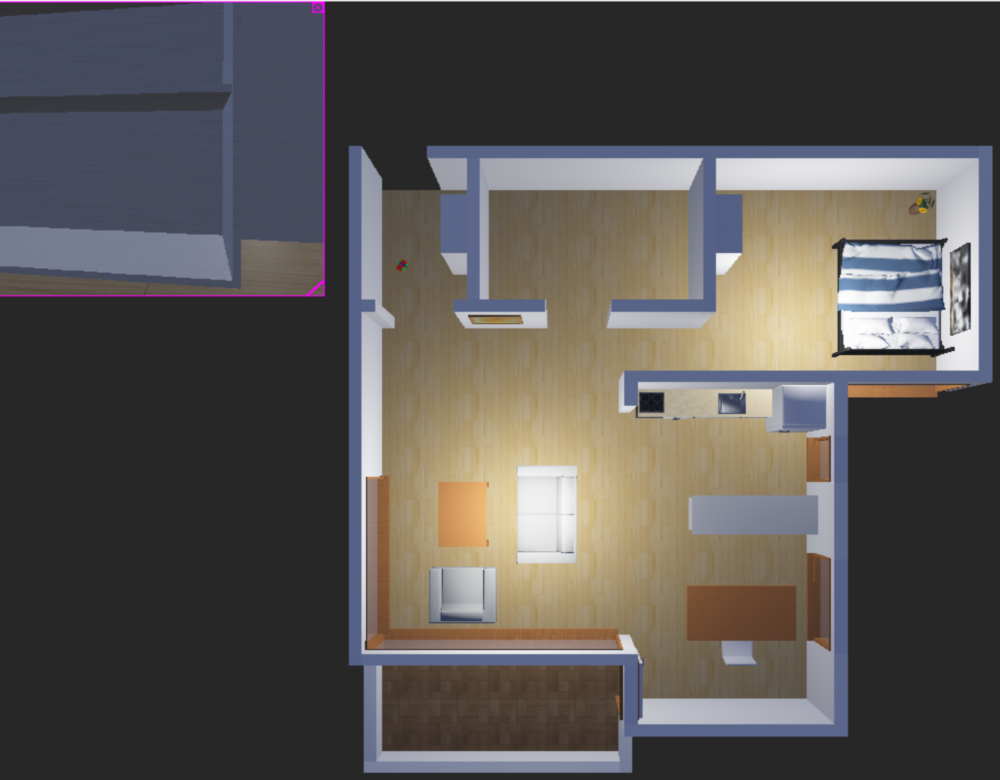
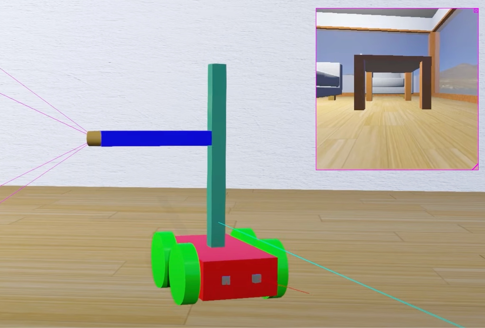
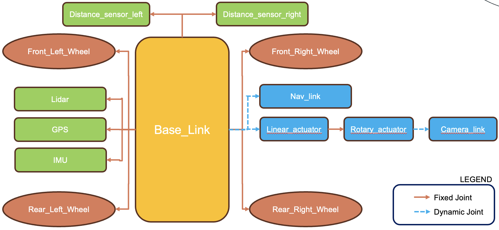
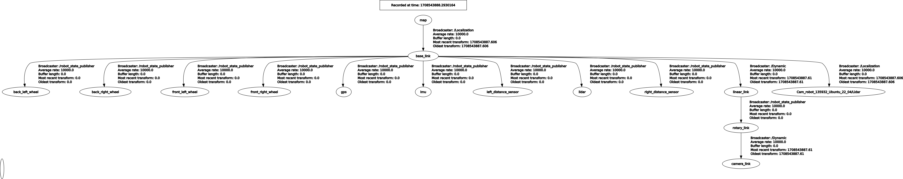
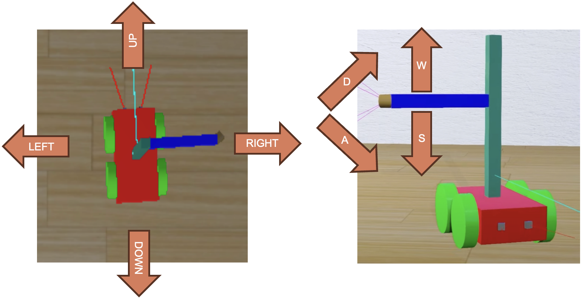
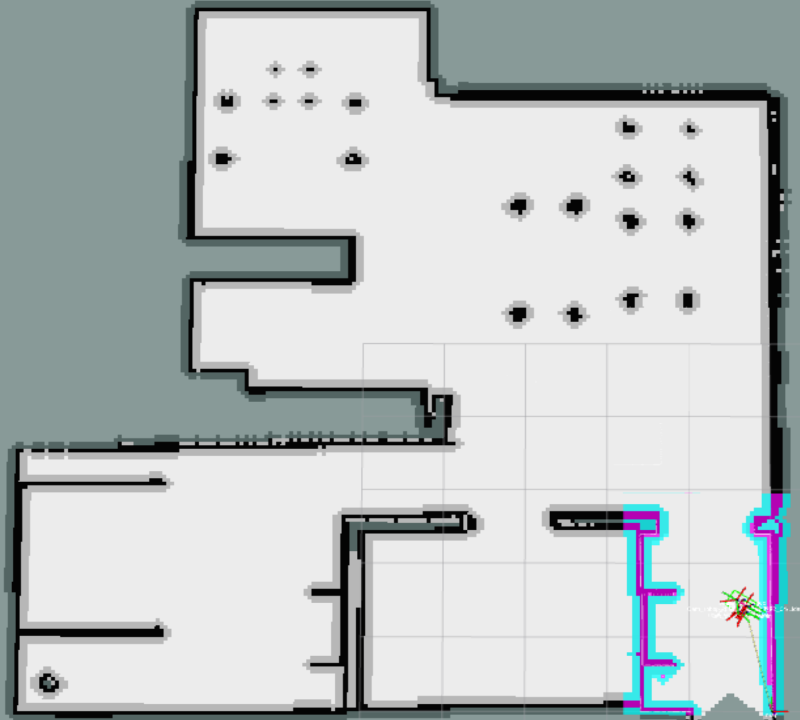

# Cleaning Robot Project
#### Copyright © 2024 Alessio Borgi

## Introduction
Welcome to the Cleaning Robot project designed by Alessio Borgi! This project is designed to simulate a cleaning robot using the Robot Operating System (ROS), Webots, and Rviz on Ubuntu 20.04. The cleaning robot is capable of mapping its environment and autonomously planning and navigating through it to achieve predefined cleaning goals.

## Instructions
1. **Installations**
   - Ensure you have Ubuntu 20.04 installed on your system.
   - Install ROS1 Noetic (Robot Operating System) following the instructions on the [official ROS website](https://www.ros.org/install/).
   - Install Webots R2021a from the [official website](https://cyberbotics.com/#download).

2. **Workspace Setup:**
   - Create a project folder using a command like `mkdir nameFolder`.
   - Go inside the project folder typing `cd nameFolder`.
   - Create inside the project folder a Workspace and a `src` folder inside it, using the command `mkdir -p CleaningRobot_ws/src`.
   - Go inside the `src` folder of the Workspace using `cd CleaningRobot_ws/src`.
   - Clone this repository inside the `src` folder using the command `git clone https://github.com/alessioborgi/CleaningRobot_RP.git`.

3. **Dependencies and Packages Installation**
   - Go inside the Workspace folder and install RosDepth using `sudo apt-get install python3-rosdep`.
   - Initialise RosDepth using `sudo rosdep init`.
   - Update rosdep in such a way to look for the required versions using `rosdep update`.
   - Go in the `robot_settings` package using `cd robot_settings`. 
   - Install all the dependencies required by the package using `rosdep install --from-paths src --ignore-src-r-y`.
   - Go back to the Workspace fodler using `cd ..`. 
   - Go in the `navigation` package using `cd navigation`. 
   - Install all the dependencies required by the package using `rosdep install --from-paths src --ignore-src-r-y`.

4. **Launching the Project:**
   - Go inside the Workspace folder using the command `cd nameFolder/CleaningRobot_ws`.
   - Build the whole Cleaning Robot Project using `catkin build`.
   - Configure ROS environment variables using the `source devel/setup.bash` command.
   - Launch the whole project using `roslaunch robot_settings master.launch`.
   - At this point two windows should be opened: one being Webots and the other being Rviz, through which you can monitor robot behavior and perform all the operations.

## Home Environment
The Cleaning Robot will work and perform its tasks in a WeBots' Home, with the following graphical representation, allowing you to both see the top-view of the robot in the house, but also the robot's point of view, thanks to the top-left Camera-viewpoint.  

  

## Robot Structure & URDF
The robot's body is a rectangular box capable of moving in four directions: front, back, left, and right. It is equipped with a Linear Actuator and a Rotary Actuator, both connected to a camera. This combination enables the robot to adjust the camera viewpoint vertically (up and down) and horizontally (left and right). Additionally, the robot is outfitted with two Distance Sensors, two GPS units, Lidar, and an IMU (Inertial Measurement Unit). It's important to note that the wheels, distance sensors, and other components are fixed relative to the center of the body box, essentially acting as fixed joints. Conversely, the camera mechanism, which moves relative to the body, is classified as a continuous joint.

  

The Robot Structure description is physically described using the **URDF (“Unified Robot Description Format”)**, being the way to physically describe the Robot to ROS. In summary, fixed parts are connected using fixed joints, while the linear_actuator (which can move up and down) and the camera_link (which can rotate over itself), are linked using a continuous joint. Also, the Navigation is classified as a dynamic/continuous joint. This is equivalent to passing local parameters to methods. Indeed, the robot_description package converts the “CleaningRobot.xacro” file in the URDF,  and places it into the Parameter Server. The “robot_state_publisher” robot node, will then extract the URDF file from the  Parameter Server and broadcast the 3D pose of the robot link to the transform library in ROS. 
 

  

We can verify that the whole Robot Setting opening a new terminal in the Workspace folder and to ask for the `rqt_gui`, using the following command: `rosrun rqt_gui rqt_gui`. If the project is correctly working, you will have the following: 

  

## TeleOp (Keyboard)
The first functionality provided in this project is the **TeleOperation through the Keyboard**, allowing you to control your robot movements in the Home and also the Camera Orientation and Position using keyboard inputs. This feature enables you to manually drive or manipulate your robot's movements and actions in real-time by sending commands via the keyboard.

  

Notice that you can also monitor the TeleOperation Topic by, while the Project is running, do:
- Open another Terminal and type the command `rostopic list`.
- From this list, one of these has this form `/Cam_robot_xxxxxx_NameOfYourMachine` with `xxxxxx` changing at each master.launch.
- Save this result and now type the command `rostopic echo /Cam_robot_xxxxxx_NameOfYourMachine/keyboard/key`.
At this point, the Terminal should echo the keyboard keys it receives as input. 

## SLAM (Simultaneous Localization and Mapping) with GMapping

Another project functionality is the ability to perform **SLAM ("Simultaneous Localization and Mapping")** task, consisting in having the Robot that creates a map of the environment it needs to operate into and, in parallel, estimate the position and orientation in that built map (i.e., Localization). This is achieved by merging the sensed results obtained from the diverse sensors mounted on the robot. 

### GMapping
The package used for this task implementation is **GMapping**, implemented using the SLAM Algorithm called **Rao-Blackwellized Particle Filter**. This algorithm combines the advantages of particle filtering with those of Kalman filtering to provide an accurate and efficient estimation of a robot's pose and the map of its environment. By maintaining a set of particles representing different hypotheses about the robot's pose, and using a Kalman filter for each particle to estimate the map, the algorithm achieves a high degree of accuracy while remaining computationally tractable. Gmapping proposes an approach to compute an accurate proposal distribution taking into account not only the movement of the robot but also the most recent observation. This drastically decreases the uncertainty about the robot’s pose in the prediction step of the filter. The input that GMapping uses is **Raw Laser Data + Odometry**, used by the algorithm to estimate the Robot Pose w.r.t. the odometry, providing a map to Odom_link as an output. The other crucial output is the map or a 2D occupancy grid, being a representation of the environment, displaying the obstacles and the free spaces that have been scanned. 

### SLAM Building Instructions
In order to perform another **Simultaneous Localization and Mapping** of your house or whatever place you decide to employ the robot, you will need to checkout to the other branch present in this repo called `SLAM_Building` by using the command `git checkout SLAM_Building` in the workspace folder. In this way, the project will be redirected to the version of the project where SLAM is available, since in the master branch, there is the already saved image Home Map. 

To run it, then, we will have to open two terminals in the workspace:
- **Terminal 1**: 
   - Build the Project using `catkin build`.
   - Re-source the project with `source devel/setup.bash`.
   - Launch the master by using `roslaunch bringup master.launch`.
- **Terminal 2**:
   - Initialize the GMapping Node with `rosrun gmapping slam_gmapping scan:=/Cam_robot_xxxx_Ubuntu_22_04/Lidar/laser_scan/layer0`, with the precise name of the Cam_robot_xxxxxx_... taken by doing `rostopic list`.
 
Here it is the Video of the SLAM building.

  

  <a href="https://www.youtube.com/your-video-link" style="position: absolute; top: 50%; left: 50%; transform: translate(-50%, -50%); background-color: rgba(0, 0, 0, 0.5); color: white; padding: 10px 20px; text-decoration: none; border-radius: 5px;">
    Watch Video
  </a>
  

### Saving the Map
This map can be saved using the **Map Server** Ros Package and can be used for Navigational purposes. The following, can be achieved by typing in a new Terminal the following 	`rosrun map_server map_saver -f  src/robot_settings/maps/map`. 

The result that we will obtain in the folder is like the following.

  

